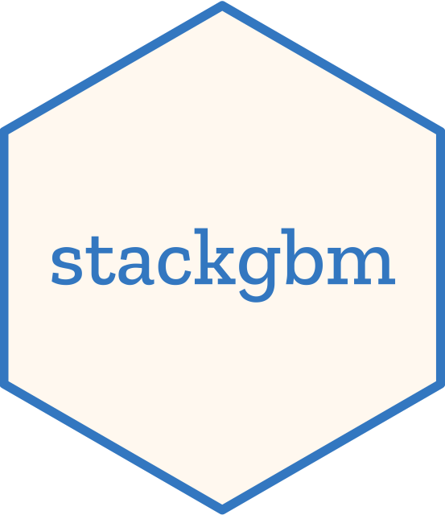

# stackgbm 

<!-- badges: start -->
[](https://github.com/nanxstats/stackgbm/actions/workflows/R-CMD-check.yaml)
<!-- badges: end -->

stackgbm offers a minimalist, research-oriented implementation of model stacking
([Wolpert, 1992](https://doi.org/10.1016/S0893-6080(05)80023-1))
for gradient boosted tree models built by
xgboost ([Chen and Guestrin, 2016](https://doi.org/10.1145/2939672.2939785)),
lightgbm ([Ke et al., 2017](https://dl.acm.org/doi/10.5555/3294996.3295074)),
and catboost ([Prokhorenkova et al., 2018](https://dl.acm.org/doi/abs/10.5555/3327757.3327770)).

## Installation

The easiest way to get stackgbm is to install from CRAN:

```r
install.packages("stackgbm")
```

Alternatively, to use a new feature or get a bug fix,
you can install the development version of stackgbm from GitHub:

```r
# install.packages("remotes")
remotes::install_github("nanxstats/stackgbm")
```

To install all potential dependencies, check out the instructions from
[manage dependencies](https://github.com/nanxstats/stackgbm/wiki/Manage-dependencies).

## Model

stackgbm implements a classic two-layer stacking model: the first layer
generates "features" produced by gradient boosting trees.
The second layer is a logistic regression that uses these features as inputs.

## Related projects

For a more comprehensive and flexible implementation of model stacking, see
[stacks](https://stacks.tidymodels.org) in tidymodels,
[mlr3pipelines](https://mlr-org.com/gallery/pipelines/2020-04-27-tuning-stacking/) in mlr3,
and [StackingClassifier](https://scikit-learn.org/stable/modules/generated/sklearn.ensemble.StackingClassifier.html)
in scikit-learn.

## Code of Conduct

Please note that the stackgbm project is released with a
[Contributor Code of Conduct](https://nanx.me/stackgbm/CODE_OF_CONDUCT.html).
By contributing to this project, you agree to abide by its terms.
